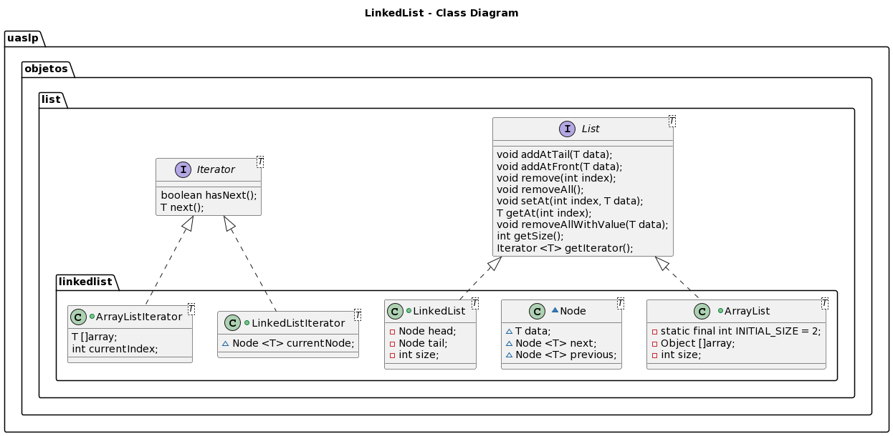

@startuml

title LinkedList - Class Diagram
interface uaslp.objetos.list.List <T> {
void addAtTail(T data);
void addAtFront(T data);
void remove(int index);
void removeAll();
void setAt(int index, T data);
T getAt(int index);
void removeAllWithValue(T data);
int getSize();
Iterator <T> getIterator();
}

interface uaslp.objetos.list.Iterator<T> {
boolean hasNext();
T next();
}

+class uaslp.objetos.list.linkedlist.LinkedList <T> implements uaslp.objetos.list.List{
-Node head;
-Node tail;
-int size;
}

~class uaslp.objetos.list.linkedlist.Node <T>{
~T data;
~Node <T> next;
~Node <T> previous;
}

+class uaslp.objetos.list.linkedlist.LinkedListIterator <T> implements uaslp.objetos.list.Iterator{
~ Node <T> currentNode;
}

+class uaslp.objetos.list.linkedlist.ArrayList <T> implements uaslp.objetos.list.List{
- static final int INITIAL_SIZE = 2;
- Object []array;
- int size;
  }
  +class uaslp.objetos.list.linkedlist.ArrayListIterator <T> implements uaslp.objetos.list.Iterator{
  T []array;
  int currentIndex;
  }

@enduml

